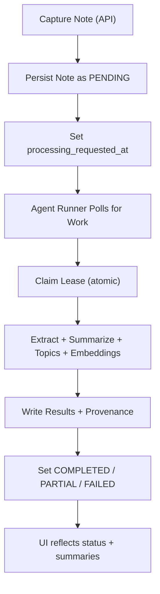

# Notes Async Processing via Agent (Single-User Proposal)

## Why this option is viable
For a single-user system, moving heavy note processing out of request/response APIs is a good fit:
- Faster note capture UX (write first, process later).
- Simpler API routes (persist + mark for processing).
- Easier to evolve processing logic without coupling to live HTTP requests.

This is especially useful when extraction/summarization/embedding latency is unpredictable.

## Current baseline
Today, processing is triggered from API routes and may use queue/direct fallback:
- `/Users/amirjalali/amirhjalali.com/app/api/notes/route.ts`
- `/Users/amirjalali/amirhjalali.com/app/api/notes/[id]/process/route.ts`
- `/Users/amirjalali/amirhjalali.com/lib/note-processing-service.ts`
- `/Users/amirjalali/amirhjalali.com/lib/queue/note-queue.ts`

## Proposed model
Use a dedicated asynchronous agent runner (script/service) that claims pending notes and processes them in batches.

## Recommended processing states
Reuse existing `processStatus` with strict transitions:
1. `PENDING` -> waiting for agent
2. `PROCESSING` -> lease claimed
3. `INDEXED` -> embeddings complete (optional intermediate)
4. `COMPLETED` -> fully processed
5. `PARTIAL` -> some stages succeeded
6. `FAILED` -> terminal attempt until retried

## Minimal schema additions (recommended)
To support robust async claims and retries, add:
1. `processingRequestedAt DateTime?`
2. `processingLockOwner String?`
3. `processingLockUntil DateTime?`
4. `processingAttempts Int @default(0)`
5. `nextProcessingAt DateTime?`
6. `processorVersion String?`
7. `processedBy String?` (for provenance)

These can be added to `Note` in:
- `/Users/amirjalali/amirhjalali.com/prisma/schema.prisma`

## Agent runner shape
Create:
- `/Users/amirjalali/amirhjalali.com/scripts/agent-note-worker.ts`

Responsibilities:
1. Poll eligible notes (`PENDING|FAILED` and `nextProcessingAt <= now`).
2. Atomically claim one note (`updateMany` with lock preconditions).
3. Run processing pipeline (`lib/note-processing-service.ts` internals).
4. Persist outputs and status.
5. On error, increment attempts and set backoff.
6. Release/expire lock safely.

## API behavior after migration
Keep APIs thin:
1. `POST /api/notes`: create note, set `PENDING`, set `processingRequestedAt`.
2. `POST /api/notes/[id]/process`: requeue by resetting status and schedule fields.
3. Do not execute extraction/summarization in request thread.

## Operational modes
Three practical deployment modes:
1. Local scheduled runner (Codex automation/cron on your machine).
2. GitHub Actions scheduled worker (if DB/network is reachable).
3. Small always-on worker service (Fly/Render/etc.).

For single-user reliability, mode #1 is simplest if your machine is usually on.

## Pros vs cons

Pros:
1. Better UX at capture time.
2. Clear separation of concerns.
3. Easier retry/backoff and observability.
4. Lower risk of API timeouts.

Cons:
1. Eventual consistency (notes are not processed immediately).
2. Need operational runner availability.
3. More state-management discipline required.

## Recommendation
Adopt a **hybrid migration**:
1. Phase 1: Keep existing processing code, move execution to agent runner.
2. Phase 2: Remove queue/direct fallback from APIs.
3. Phase 3: Add richer summaries and retrieval improvements after pipeline is stable.

This keeps risk low while moving to the structure you asked for.

## Implementation plan (low risk)
1. Add processing lease/scheduling fields to schema + migration.
2. Add `scripts/agent-note-worker.ts` with `--once` and `--daemon`.
3. Refactor processing entrypoint into reusable function for script + APIs.
4. Update capture/process APIs to enqueue-only semantics.
5. Update UI messaging: `Queued for processing by agent`.
6. Add small health endpoint for runner freshness.

## Success criteria
1. Note creation P95 latency stays low and stable.
2. 95% of notes reach `COMPLETED|PARTIAL` within target SLA.
3. No double-processing for same note under concurrent workers.
4. Retry behavior is deterministic and observable.

